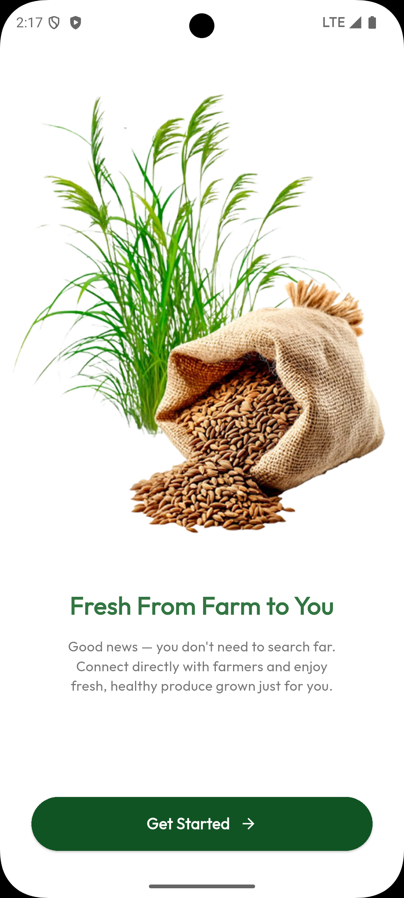
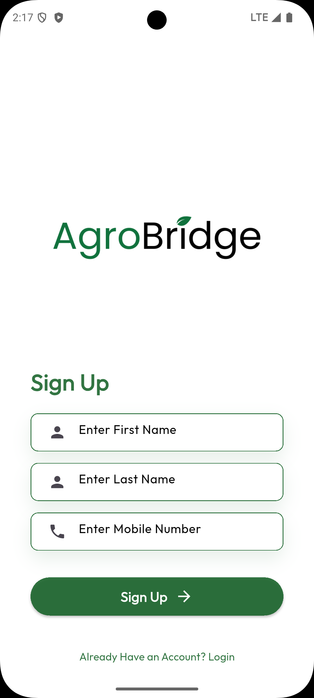

# AgroBridge - Flutter App

AgroBridge is a **farmer-first, fair-trade agricultural mobile platform** developed for the mSpace National Hackathon 2025. It is designed to empower farmers by **directly connecting them with consumers and verified buyers**, eliminating exploitative middlemen and ensuring fair pricing, transparency, and inclusivity.

<p align="center">
  
  
  
</p>
---

## 📆 Hackathon Team

**Team Name:** GreenStack 

**University:** University of Moratuwa

| Photo                                          | Name                  | Department | University             | GitHub                                    | Role                                          |
| ---------------------------------------------- | --------------------- | ---------- | ---------------------- | ----------------------------------------- | --------------------------------------------- |
|     | Parishith Ragumar     | CSE        | University of Moratuwa | [ragupari](https://github.com/ragupari)       | Team Lead, Development Planning, Deployment  |
|     | Rahavi Sirithar       | CSE        | University of Moratuwa | [RahaviSiri](https://github.com/RahaviSiri) | UI/UX Designer, Flutter Developer, Frontend-Backend Communication    |
|  | Kajaluxan Sivakumaran | CSE        | University of Moratuwa | [Kajaluxan](https://github.com/Kajaluxan) | Backend Developer, API Design & Management, Test support |
|  | Aanchikan Subaskaran  | Civil      | University of Moratuwa |  | Team Manager                 |

---
## 🌿 Key Features

### ✉️ Direct Connections

* **Farmer-to-Consumer and Farmer-to-Buyer model**
* **No middlemen**
* **Transparent fixed pricing**

### 📱 Multi-Device Access

* **Flutter-based mobile interface** for Android & iOS
* **SMS/USSD** integration for feature phone access via mSpace APIs
* **Voice/text notifications** for order updates and market trends

### ⏲️ Real-Time Tracking & Inventory

* **Order tracking** for both farmers and buyers
* **Live inventory updates** by farmers

### 💳 Secure Payments

* **Multiple payment methods:** PayPal, Stripe, mCash, eZ Cash
* **Escrow service** to ensure fair trade

### 🔍 Product Listings & Discovery

* Listings with **images, descriptions, fixed pricing**
* **Search & filter** by category, price, location
* **Buyer and seller ratings** and profiles

### 🧠 AI-Powered Tools

* **AI Chatbot Assistant** with local language support for farmers
* **Auto-generated product descriptions** for niche products

---

## 🛠️ mSpace APIs Used

| API                  | Purpose                                                     |
| -------------------- | ----------------------------------------------------------- |
| **CaaS API**         | Micro-payment deductions from mobile credit                 |
| **Subscription API** | Role-based access (Farmer, Buyer, Admin) + targeted updates |
| **OTP API**          | Secure OTP-based login/authentication                       |
| **SMS API**          | Real-time SMS/USSD alerts for orders, payments, etc.        |

---

## 🚀 Vision

AgroBridge aims to revolutionize Sri Lanka's agricultural supply chain into one that is **inclusive, traceable, and sustainable** by:

* Empowering rural farmers
* Enabling fair trade
* Bridging the digital divide

---

## 📁 Project Structure (Flutter)

```
lib/
|-- main.dart
|-- screens/
|   |-- home_screen.dart
|   |-- product_list.dart
|   |-- order_tracking.dart
|   |-- login_screen.dart
|-- models/
|-- services/
|   |-- api_service.dart
|   |-- sms_service.dart
|-- widgets/
|-- utils/
```

---

## 📅 Status

* ✅ Initial MVP prototype completed
* ✅ Integrated mSpace APIs for SMS and OTP
* ⏳ Payment and escrow integration under development

---

## 📢 Feedback & Contributions

Have ideas or feedback? Fork this repo and send a pull request or raise an issue.

---

## 📂 Backend Repository

**GitHub:** [AgroBridge Backend Repo](https://github.com/ragupari/AgroBridge-Backend)

---

## 💡 How to Run the App

### 1. Clone the repository

```bash
git clone https://github.com/ragupari/AgroBridge-FlutterApp.git
cd AgroBridge-FlutterApp
```

### 2. Set up dependencies

```bash
flutter pub get
```

### 3. Create a `.env` file at the root of the project

```
API_BASE_URL=
```

Make sure to use your own backend API URL if deployed elsewhere.

### 4. Run the app

```bash
flutter run
```

---

**AgroBridge** - Bridging Farmers and Markets for a Fairer Future 🤾‍♂️🌿
